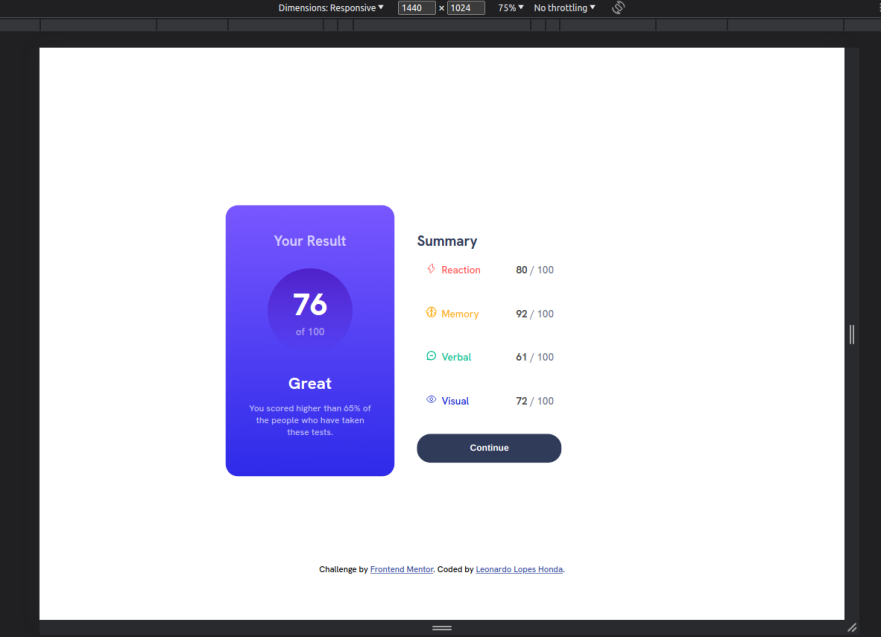
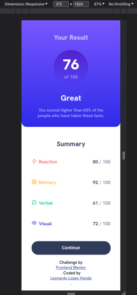

# Frontend Mentor - Results summary component solution

This is a solution to the [Results summary component challenge on Frontend Mentor](https://www.frontendmentor.io/challenges/results-summary-component-CE_K6s0maV). Frontend Mentor challenges help you improve your coding skills by building realistic projects. 

## Table of contents

- [Overview](#overview)
  - [The challenge](#the-challenge)
  - [Screenshot](#screenshot)
  - [Links](#links)
- [My process](#my-process)
  - [Built with](#built-with)
  - [Useful resources](#useful-resources)
- [Author](#author)

## Overview

### The challenge

Users should be able to:

- View the optimal layout for the interface depending on their device's screen size
- See hover and focus states for all interactive elements on the page

### Screenshot

### Links

- Solution URL: (https://github.com/LeonardoLopesHonda/Results-summary-component)
- Live Site URL: (https://leonardolopeshonda.github.io/Results-summary-component/)

## My process

### Built with

- Semantic HTML5 markup
- CSS custom properties
- Flexbox
- Desktop-first workflow

### Useful resources

- [SVG to your code](https://www.svgrepo.com/) - This helped me with the SVGs.

## Author

- Linkedin - [Leonardo Honda](https://www.linkedin.com/in/leonardo-honda-9a3383248/)
- Frontend Mentor - [@LeonardoLopesHonda](https://www.frontendmentor.io/profile/LeonardoLopesHonda)